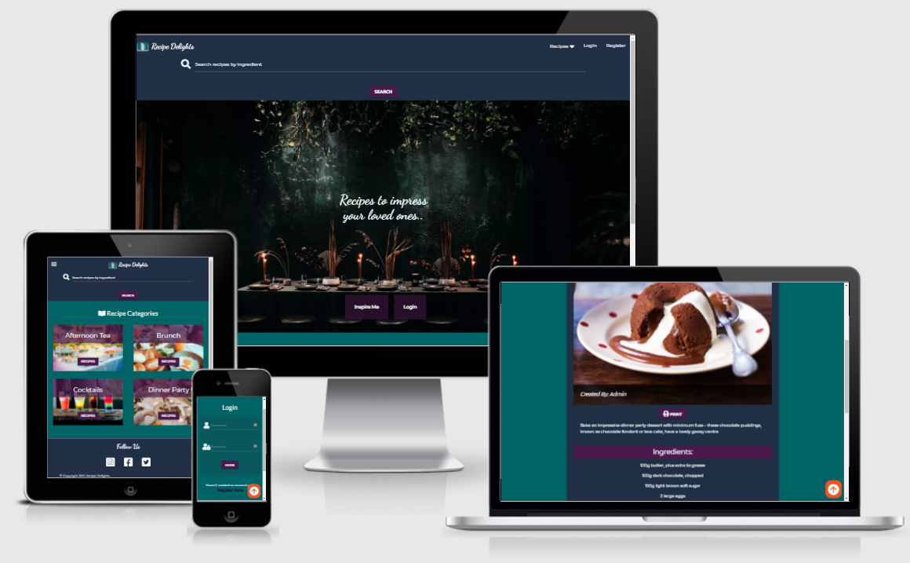
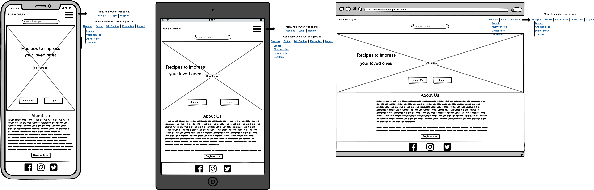
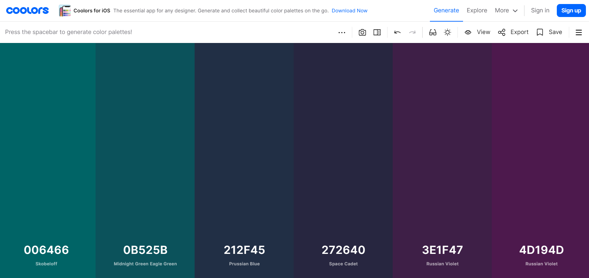
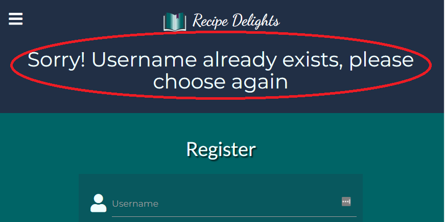
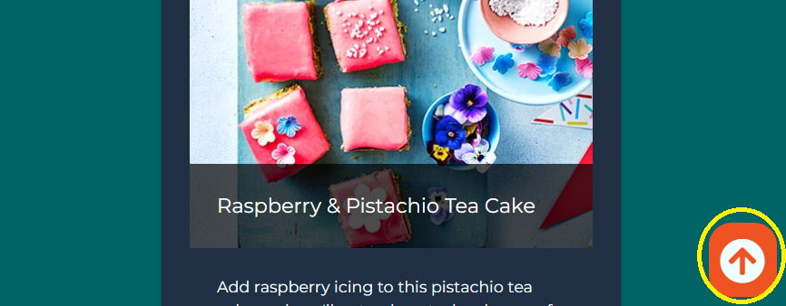
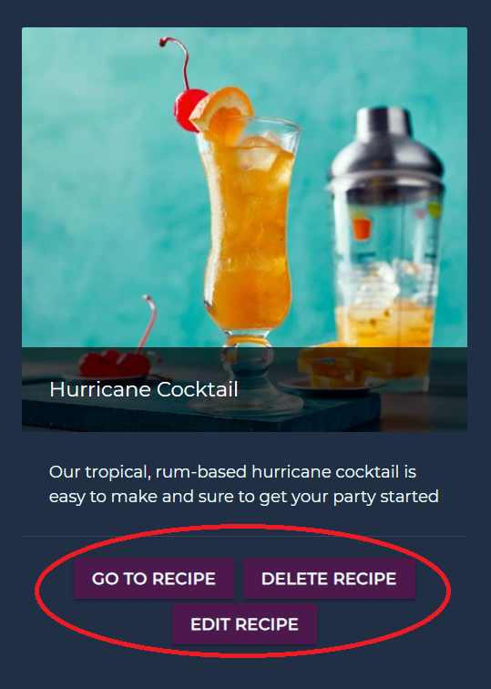
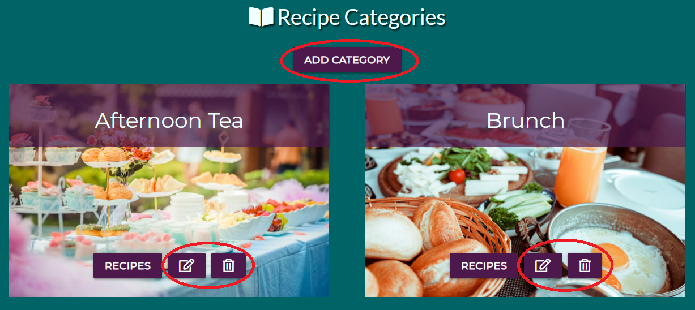
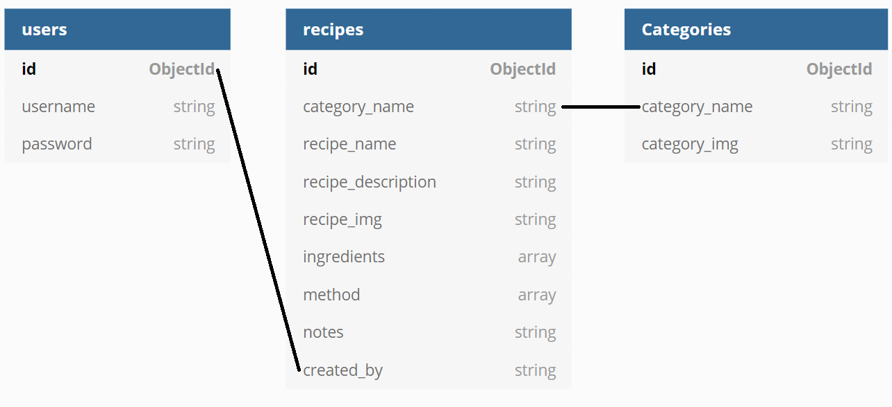

# **Recipe Delights**

[Link to Website](https://recipe-delights-ms3.herokuapp.com/)

---

# **Table Of Contents**
- [Introduction](#introduction)
- [User Experience](#user-experience)
  - [User Stories](#user-stories)
  - [Wireframes](#wireframes)
  - [Design](#design)
- [Features](#features)
  - [Current Features](#current-features)
  - [Future Features](#future-features)
- [Database](#database)
- [Technologies Used](#technologies-used)
  - [Languages](#languages)
  - [Frameworks And Libraries](#frameworks-and-libraries)
- [Testing](#testing)
- [Deployment](#deployment)
- [Credits](#credits)
- [Acknowledgments](#acknowledgments)

---

# **Introduction**

Recipe Delights is a community based recipe collection containing recipes for special occasions, such as afternoon tea and dinner parties. Users have the option of browsing all the recipes when not logged in, however registering an account will allow the user to add, edit and delete recipes also. Inspiration for this website came from my love of food and wanting a unique website to showcase recipes for those more special events.

---

# **User Experience** 

## **User Stories**

As a user I would like:

1. To easily navigate throughout the website
2. To easily determine what the website is for on first inspection
3. To be able to view recipes without having to register first
4. A varied collection of recipes which are easily found
5. To be able to register an account
6. The ability to search for specific recipes
7. To be able to log in or log out as needed
8. The option to easily print recipes 
9. To easily add a new recipe to any recipe category
10. To easily edit or delete any added recipes as needed
11. Informative validation feedback
12. To have the ability to add a new recipe category when logged in as admin
13. To have the ability to edit or delete any existing recipe categories as needed when logged in as admin

## **Wireframes**

* Balsamiq was used to show the initial wireframes I had created for the website on the three devices mobile/tablet/desktop with the homepage been shown below.
  * [View All Other Pages Here](https://github.com/RCass172/recipe-delights/blob/main/static/images/README/wireframes.png)

  

## **Design**

* Hero Image - The table setting used for the hero image was chosen to relate to the website and colors matched in with the overall theme.
* Colors - I wanted to use rich colors to give an elegant feeling to match the overall theme. Using [Coolors](https://coolors.co/) color palette generater I was able to find the below set which i was happy with.

* Fonts - I used the Dancing Script and fallback font of cursive to add a sense of style and elegance to the website by using on the hero image text and welcoming message on user profile. I then paired the Lato and Montserrat fonts throughout the website which both match well together with a fallback font of sans-serif. These were integrated into the website using [Google Fonts](https://fonts.google.com/).
* Logo - The website logo was created on the website [Free Logo Design](https://www.freelogodesign.org/) which is used on the navigation bar. 

---

# **Features**

## **Current Features**  

### **Registered And Non Registered Users**

- Navigation Bar
  - The website has a fixed navbar with clickable logo and website name which will take the user back to the homepage
  - There is a dropdown for the recipes which have all recipe categories
  - There is a register and login button for users depending if it's a new or returning user
  - The navbar is responsive when on smaller devices from ipads down with menu items being shown once the burger icon is clicked

- Responsive Layout
  - The layout is responsive on all different sized devices from mobiles to desktops, in order to make all content easily readable and for best aesthetics

- Search Bar
  - A search bar is included just under the navbar for users to easily find any recipe they are looking for. I used MongoDB's indexes to allow users to find any recipe by name or ingredient

- Flash Messages
  - All messages confirming any user actions are displayed underneath the navbar to let users know whether their action was successful or not. As below a new user who tries a username already in database will get the below message so they can try again

    

- Buttons
  - All buttons were styled the same for a consistant look throughout the website
  - On hovering over any button the background color will change to give visual feedback to the user

- Print Button
  - I added a print button which is found on all full recipes to allow the user to easily print the page if needed

- Back To Top
  - I created a back to top button which shows once the user scrolls down. This is in order for the user to easily navigate back to the top of the page if needed
  - This has a hover effect which changes color to give visual feedback to user

    

- Footer
  - The footer which is fixed to the buttom of page includes the social media links for user to follow. These links use a hover effect for visual feedback and on clicking will open a new tab

- Error pages
  - Error pages have been made in case of pages not being found, no authorisation to enter a certain page or server being down. A button to take user back to the homepage is also present
  - All have the same layout as below error 404 but with relevant messages, i.e "You're not allowed on this page" for an error 403 and "Something happened the server" for error 500

    

### **Registered Users Only**

All registered users have all the above features with added:

- User Profile
  - On registering or logging in a user is brought to their homepage where any recipes they add will be saved.
  - An added nav menu item of "Add Recipe" is now visable to users logged in to easily add a new recipe. A button is also shown once the user is on their profile page to make is easy to add a recipe

    

- Recipe Management
  - Once users are logged in and created their own recipe they will now have the option to edit or delete any of their own recipes. This is easily done on their profile page with a "delete recipe", "edit recipe" or "go to recipe" buttons on each recipe card
  - This now completes the basic CRUD functions of allowing a user to create, read, edit and delete a recipe.

    

### **Admin User**

Once logged in as an admin user all the above feature are relevant plus:

- Admin Management
  - Once on the admin profile page the user has the power to add, edit or delete any recipe categories by clicking on "Go To Category" button
  - Buttons to "Add Category", "Edit" and "Delete" are found on the recipe categories page which is only visable to an admin user

    

## **Future Features**

- Favorite Recipes
  - As seen in my initial wireframes above I had hoped to include a favorite button to the recipes in order for users to save them to their profile. Unfortunatly due to lack of time and knowledge it wasn't something I was able to implement but would love to add in the future. This would allow users to save their favorite recipes and easily find them at a later date

- Ratings and Comments
  - I would love to add a rating system and comment section to each recipe to help users better interact with others on the website and to get a better understanding of each recipe

- Delete Profile
  - I would love to add the ability for a user to be able to delete their account if needed, which would in turn remove their user details and any recipes they may have added

---

# **Database**

I used MongoDB to store all the relevant data for the website. Below is the schema I used:

  

---

# **Technologies Used**

## **Languages**

- [HTML](https://en.wikipedia.org/wiki/HTML)
- [CSS](https://en.wikipedia.org/wiki/CSS)
- [JavaScript](https://en.wikipedia.org/wiki/JavaScript)
- [Python](https://www.python.org/)
- [Jinja](https://jinja.palletsprojects.com/en/3.0.x/)
- [JQuery](https://jquery.com/)

## **Frameworks And Libraries**

- [Materialize v1.0.0](https://materializecss.com/getting-started.html) - used for responsive pages  
- [Cloud Convert](https://cloudconvert.com/webp-converter) - used to compress images for better performance by converting to webp files
- [Fontawesome](https://fontawesome.com/)- used for the icons 
- [Google Fonts](https://fonts.google.com/) - Lato/Roboto/Dancing Script was used on website, imported to the style.css file
- [Pexels](https://www.pexels.com/)
- [Balsamiq](https://balsamiq.com/) - used to create wireframes
- [DBDiagram](https://dbdiagram.io/home) - used to create database schema
- [Favicon Generator](https://www.favicon-generator.org/) - used to create the favicons
- [MongoDB](https://www.mongodb.com/) - database used to store all website data
- [Flask](https://flask.palletsprojects.com/en/2.0.x/) - framework used
- [Heroku](https://www.heroku.com/home) - cloud platform used to deploy the website
- [Werkzeug](https://werkzeug.palletsprojects.com/en/1.0.x/) - used for password hashing and authentication
- [Git](https://git-scm.com/) - used for version control
- [Gitpod](https://www.gitpod.io/) - used to write code before pushing to GitHub for storage
- [GitHub](https://github.com/) - used to host website

---

# **Testing**

You can find all testing information [here](https://github.com/RCass172/recipe-delights/blob/main/TESTING.md)

---

# **Deployment**

### Forking The Repositary

1. Open GitHub and find relevant [repository](https://github.com/RCass172/recipe-delights).
2. On the top right click the fork button.
3. This will now save a copy of the repository to your account which you can edit without changing original.

### Making Local Clone

1. Open GitHub and find relevant [repository](https://github.com/RCass172/recipe-delights).
2. Click the download code dropdown.
3. Using the clone HTTPS option copy the link provided.
4. Open Git Bash and change working directory to location where you want cloned directory to go.
5. Type `git clone` command and paste the clone link you had copied.

### Heroku Deployment

Firstly in order to deploy to Heroku it is important you create a requirements.txt file and a Procfile to let Heroku know what are the necessary dependencies to run the project

- To create the requirements.txt file type the following command into the terminal window of the IDE you are using: `pip3 freeze --local > requirements.txt`

- To create the Procile type the following command into the terminal window of the IDE that you are using: `echo web: python run.py > Procfile`

1. go to [Heroku](https://heroku.com) and login to your own account
2. click the "new" button > "create new app"
3. Create an app name and select your nearest region

- Connect the Github repository to our Heroku app

1. Click the "deploy" tab on your dashboard
2. Under the deployment method section select GitHub
3. Under the prompt to find the GitHub repository to connect to enter the name of the repository and click connect

- Add the environment variables

1. Click the "settings" tab on your dashboard
2. Click on "reveal config vars" and add the following:
    - key: IP, Value: 0.0.0.0
    - key: PORT, Value: 5000
    - key: MONGO_DBNAME, value(Name of the database you are connecting to)
    - key: MONGO_URI, value(The Mongo URI can be found in MongoDB by going to clusters > click on connect and connect to your app > change the password and the databse name to what you set)
    - key: SECRET_KEY, value(A custom secret key of your own choosing which is used to keep sessions secure)

- Enable automatic deployment 

1. Click on the "deploy" tab
2. In the automatic deployment section, choose the branch you want to deploy from the GitHub repository and then click on the "enable automatic deploy" button

---

# **Credits**

## Content

***Photos***
  - Photo by Fu Zhichao from Pexels - [Afternoon Tea](https://www.pexels.com/photo/white-steel-cupcake-stand-587741/)
  - Photo by Emrah Tolu from Pexels - [Brunch](https://www.pexels.com/photo/fried-egg-beside-bread-platter-2662875/)
  - Photo by Askar Abayev from Pexels - [Dinner Party](https://www.pexels.com/photo/friends-having-delicious-dinner-with-drinks-served-on-wooden-table-5638730/)
  - Photo by Ahmad Syahrir from Pexels - [Cocktails](https://www.pexels.com/photo/four-cocktail-glasses-on-brown-wooden-surface-605408/)
  - Photo by Rachel Claire from Pexels - [Hero Image](https://www.pexels.com/photo/row-of-stools-next-to-long-table-covered-with-tablecloth-in-dark-hall-4577179/)
  - Photo by Markus Distelrath from Pexels - [Error Page Image](https://www.pexels.com/photo/grey-bird-in-close-up-photography-2233442/)

***Recipes***
  - All recipes content and photos taken from [BBC Good Food](https://www.bbcgoodfood.com/)
  - [Brioche Bake Recipe](https://www.bbcgoodfood.com/recipes/brioche-breakfast-bake-crispy-bacon) and [Image](https://images.immediate.co.uk/production/volatile/sites/30/2020/08/brioche-breakfast-bake-with-crispy-bacon-7bf0b52.jpg?quality=90&webp=true&resize=375,341)
  - [Courgette Ricotta Fritters Recipe](https://www.bbcgoodfood.com/recipes/courgette-ricotta-fritters-with-poached-eggs-harissa-yogurt) and [Image](https://images.immediate.co.uk/production/volatile/sites/30/2021/06/Courgette-and-ricotta-fritters-with-poached-eggs-and-harissa-yogurt-92ecc92.jpg?quality=90&webp=true&resize=375,341)
  - [Baked Camembert Recipe](https://www.bbcgoodfood.com/recipes/baked-camembert) and [Image](https://images.immediate.co.uk/production/volatile/sites/30/2020/08/baked_camembert-de29cd6.jpg?quality=90&webp=true&resize=375,341)
  - [Beef Ragout Recipe](https://www.bbcgoodfood.com/recipes/beef-ragout) and [Image](https://images.immediate.co.uk/production/volatile/sites/30/2020/08/beef-ragout-c9c8bd0.jpg?quality=90&webp=true&resize=375,341)
  - [Chocolate Molten Cakes Recipe](https://www.bbcgoodfood.com/recipes/easy-chocolate-molten-cakes) and [Image](https://images.immediate.co.uk/production/volatile/sites/30/2020/08/easy-chocolate-molten-cakes-37a25eb.jpg?quality=90&webp=true&resize=375,341)
  - [Fruit Scones Recipe](https://www.bbcgoodfood.com/recipes/fruit-scones) and [Image](https://images.immediate.co.uk/production/volatile/sites/30/2020/08/fruit-scones-82fc434.jpg?quality=90&webp=true&resize=375,341)
  - [Tea Cake Recipe](https://www.bbcgoodfood.com/recipes/raspberry-pistachio-tea-cake) and [Image](https://images.immediate.co.uk/production/volatile/sites/30/2020/08/raspberry-pistachio-tea-cake-ae91f5f.jpg?quality=90&webp=true&resize=375,341)
  - [Hurricane Cocktail Recipe](https://www.bbcgoodfood.com/recipes/hurricane-cocktail) and [Image](https://images.immediate.co.uk/production/volatile/sites/30/2020/08/hurricane-62b2c43.jpg?quality=90&webp=true&resize=375,341)
  - [Jessica Rabbit Cocktail Recipe](https://www.bbcgoodfood.com/recipes/jessica-rabbit-cocktail) and [Image](https://images.immediate.co.uk/production/volatile/sites/30/2021/03/jessica-rabbit-f053c39.jpg?quality=90&webp=true&resize=375,340)

## Code 

- Code Institute Task Manager walkthrough was used as a basis for the website
- Help to dynamically add text fields in the add recipe form using JQuery was found [Here](https://jquerylove.com/content/how-to-use-jquery-to-dynamically-add-text-field-in-form-2004/)
- Help to create a function for a scroll back to top of page button was found [Here](https://www.w3schools.com/howto/howto_js_scroll_to_top.asp)
- Help with functioning Error pages was found [Here](https://flask-doc.readthedocs.io/en/latest/patterns/errorpages.html)
- Help to create a categories global variable was found [Here](https://liutheprogrammer.wordpress.com/2019/09/18/flask-templates-define-global-variables-for-template-usage/)
- Help to fix a duplicate ID error was found [Here](https://stackoverflow.com/questions/20233721/how-do-you-index-on-a-jinja-template)

---

# **Acknowledgments**

I would like to firstly thank my mentor Victor Miclovich who guided me throughout this project and helped point me in the right direction making it a great learning experience. His opinions and help to understand anything I was unsure about was always greatly appreciated.

To my family and friends who helped provide great and honest feedback throughout the project.

And finally thanks to the slack community for whenever I got stuck on a problem, research always pointed me in the right direction.