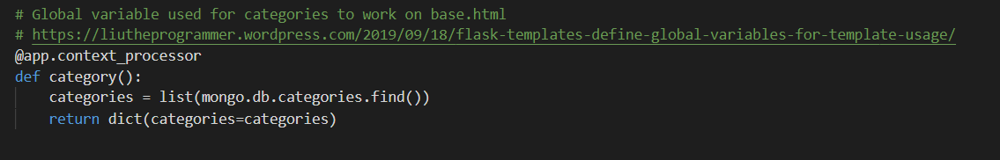

# **Testing**

# Table Of Contents
- [User Testing](#user-testing)
- [Functionality Testing](functionality-testing)
- [Bugs And Fixes](#bugs-and-fixes)

---

## **User Testing**

## **Functionality Testing**

## **Bugs And Fixes**
- When I created a dynamically functioning navbar for the recipe dropdown items it was only working on the recipe.html page. After researching I found [here](https://liutheprogrammer.wordpress.com/2019/09/18/flask-templates-define-global-variables-for-template-usage/) that creating a global template variable would work in letting me use it in the base.html.

