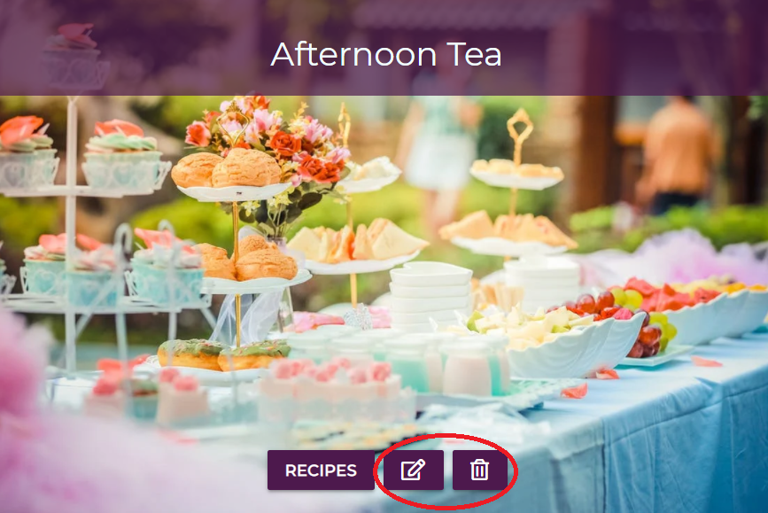

# **Testing**

# Table Of Contents
- [User Testing](#user-testing)
- [Code Validation](#code-validation)
- [Testing Responsiveness](#testing-responsiveness)
- [Testing Performance](#testing-performance)
- [Testing Functionality](#testing-functionality)
- [Bugs And Fixes](#bugs-and-fixes)

---

## **User Testing**

1. To easily navigate throughout the website
    - The navigation bar has been fixed to the top so the user can navigate easily to any section as desired. 
    - The website logo also brings the user back to homepage as a user would expect.
    - A back to top button shows once user scrolls down the page so they can easily get back to the navbar.

2. To easily determine what the website is for on first inspection
    - Once a user lands on the homepage I have the intro text explaining it's a recipe website with an about section just underneath to give more detail.

      

3. To be able to view recipes without having to register first
    - I have the recipe dropdown menu active for all users, so any new users can see all recipes without registering.
    - I also have a call to action button on the hero image to "inspire" new users which opens up the recipe category page.

4. A varied collection of recipes which are easily found
    - I have the recipe dropdown menu which includes all the different recipe categories present so users can easily pick which one to view.

      
      
      
5. To be able to register an account
    - I have the register link in the navbar and also a call to action button to register after the about section, which opens the page with a register form.
    - On clicking the register button username and password are saved in the MongoDB to allow logging in next time.
    - A flash message will appear if a user enters a username which has already been taken.

6. The ability to search for specific recipes
    - A search bar has been added just below the navbar for easy access.
    - It allows users to search any recipe in the database by name or ingredient which it will then display all relevant recipes.

      

7. To be able to log in or log out as needed
    - Once on website there is a login menu button and also one on hero image to allow users to easily open the login form.
    - A flash message will appear if incorrect username and/ password is used.
    - Once logged in the user is brought straight to their profile page and the logout menu button is now active to easily log the user out when needed.

8. The option to easily print recipes 
    - I have a print button located on all the full recipe pages to allow the user to easily open up the print terminal and print the full recipe.

      

9. To easily add a new recipe to any recipe category
    - Once the user logs in they are taken to their prifile page which has a add recipe button plus the navbar has an add recipe menu button to access page easily.
    - Once on the add recipe page the user can then fill out form which will send all data back to MongoDB and save the recipe to it's relevant category list.
    - All input fields are required with a default image URL placed in the recipe image URL input for users unable to add their own.
    - Ingredient and Method inputs have a dynamically adding button to enter more than one of each.

10. To easily edit or delete any added recipes as needed
    - Users can edit or delete any recipes they have added once they are on their profile page, where a list of all their recipes are displayed. Each recipe card has their own edit and delete button.
    - On clicking the edit button the page will open up relevant page which has all the recipe details filled in, this makes it's easier for user to edit what they need.
    - On clicking the delete button the recipe will be removed from the database and users profile.

11. Informative validation feedback
    - Throughout the website the user is given feedback with flash messages showing when users add, edit, delete recipes, log out and alerts if entered incorrect data into the input fields of all website forms.

12. To have the ability to add a new recipe category when logged in as admin
    - Once the admin user is logged in they are brought straight to their profile page where they can find a button to bring them to the category list.
    - Once there, a button is present to easily add a new categorgy which will open the add category page with relevant form.
    - The user must then enter a category name and image URL which is then used on the category page. The category name is then dynamically added to the recipe dropdown menu showing all categories.

13. To have the ability to edit or delete any existing recipe categories as needed when logged in as admin
    - As above once user goes to categories page the edit and delete button are shown on each category card.
    - On clicking the edit button the page will open up relevant page which has all the category details filled in, this makes it's easier for user to edit what they need.
    - On clicking the delete button the category will be removed from the database and website.

      

## **Code Validation**

- I used [W3C Markup Validation Service](https://validator.w3.org/nu/) to test all pages using the deployed website address. On testing first I ran into a few errors such as multiple selected options and a section element requiring a heading which i fixed.

    - Errors encountered:

      

    - On testing all pages again they came back with no errors:

      

- I used [Jigsaw CSS Validation Service](https://jigsaw.w3.org/css-validator/validator) to test the style.css code which returned no errors as shown below:

    

- I used [JsHint](https://jshint.com/) to test the script.js code which returned the below warning of a missing semicolon. I removed the `function() {}` which did remove the warning but unfortunatley the function didn't work. As I had help with the code for the function from [here](https://www.w3schools.com/howto/howto_js_scroll_to_top.asp) I left it as is in order to work correctly.

    

- I used [Python Validator](http://pep8online.com/) to test the app.py code which returned no errors:

    

## **Testing Responsiveness**

- **Device testing**

The website was tested using Google Chrome's Dev Tools to check if the website displayed well on all devices below:

  1. Moto G4
  2. Galaxy S5
  3. Pixel 2
  4. Pixel 2 XL
  5. iPhone 5/SE
  6. iPhone 6/7/8
  7. iPhone 6/7/8 Plus
  8. iPhone X
  9. iPad
  10. iPad Pro
  11. Surface Duo
  12. Galaxy Fold

_Results were good and as expected_

- **Operating system testing**

The website was tested on real devices with the following OS:

  1. Windows 10
  2. Android
  3. iOS

_Results were good and as expected_

- **Browser testing**

The website was tested on the following browsers:

  1. Google Chrome
  2. Microsoft Edge
  3. Mozilla Firefox
  4. Opera
  5. Vivaldi
  6. Brave

_Results were good and as expected_

## **Testing Performance**

Google Chrome's Dev tools were used on all pages to check the performance of the website, via their built in lighthouse tool and over all I was satisfied. See below as an example of the homepage for both desktop and mobile results, which gave the lowest score after all fixes done.

***Mobile Results:***

***Desktop Results:***

## **Testing Functionality**

Testing was done on all the features of the website to make sure everything worked as expected. All links were checked to make sure opened correctly and I was happy there were no broken links. Any external links such as the social media icons all opened in a new tab as expected. All internal links checked to make sure correct pages opened when clicked. Error pages checked to see if displayed when the wrong page was opened or server crashed.
Family and friends were asked to check all aspects of website to check for any errors or bugs.
Overall I was happy everything functioned as it should.

## **Bugs And Fixes**
- When I created a dynamically functioning navbar for the recipe dropdown items it was only working on the recipe.html page. After researching I found [here](https://liutheprogrammer.wordpress.com/2019/09/18/flask-templates-define-global-variables-for-template-usage/) that creating a global template variable would work in letting me use it in the base.html.

    

- When running JsHint to check the JavaScript code I got the use `esversion: 6` warning. I was able to fix this by adding `/*jshint esversion: 6 */` to the top of the JavaScript files

- On first adding a recipe I came across the following bug where the created by value was being added as the user ID rather than their username:

    

    I was able to fix this by changing the below created by value to `session["user"]` which added the username into the created_by field instead of ID.

    

- On carrying out the Lighthouse performance test it showed a contrast ratio issue regarging the search bar. I changed the label text to a white color so it stood out better for users.

    

- On doing a HTML validation check, the edit recipe page was coming up with the following duplicate ID error for both the ingredients and method:

    

    Unsure how to fix I was able to find help on [Stack Overflow](https://stackoverflow.com/questions/20233721/how-do-you-index-on-a-jinja-template) to add a unique index number with the ID to prevent duplication. This was carried out with both the ingredient and method ID.

    